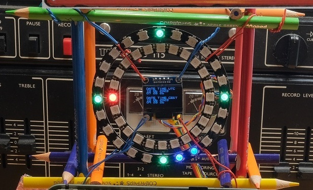
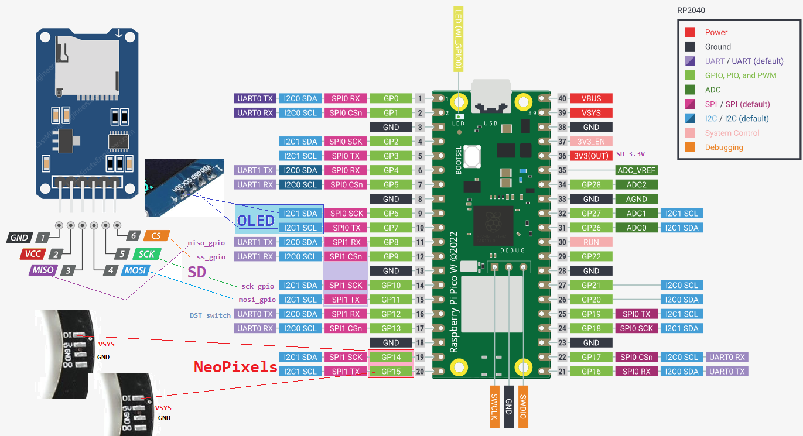

= Analog-Digital clock with NTP

== Description
[[description]]
[pdfwidth=75%]
.Description

Analog-Digital clock driven by NTP based on:

    Raspberry PI Pico W
    SSD1306 128x64 OLED display
    24x RGB LED NeoPixel circle Ø65, WS2812B
    24x RGB LED NeoPixel circle Ø85, WS2812B
    Optional microSD slot for storing WiFi config

== Wiring information
[[ssd1306_i2c_wiring]]
[pdfwidth=75%]
.Wiring Diagram for Raspberry Pi Pico W, NeoPixels, OLED and microSD Card.

== List of Files

CMakeLists.txt:: CMake file to incorporate the example into the examples build tree.
ssd1306_i2c_1.cpp:: The main code.

