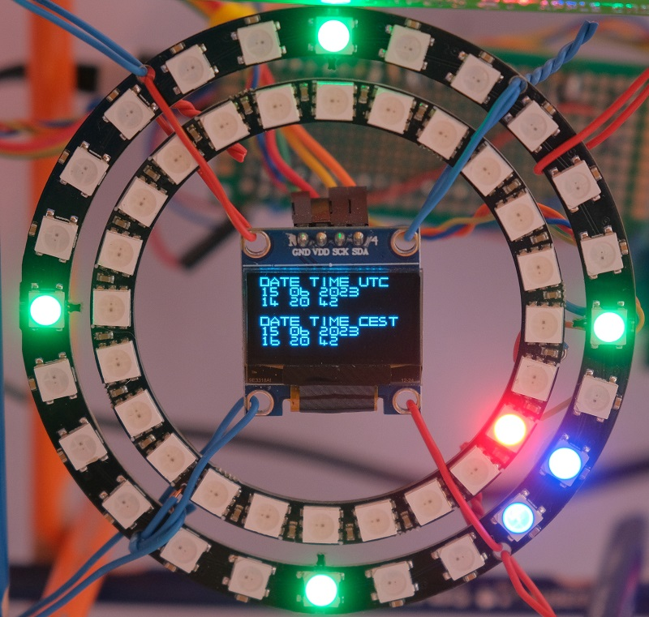

= NeoPixel / OLED clock with NTP

== Description
[[description]]
[pdfwidth=75%]
.Description

NeoPixel / OLED clock driven by NTP based on:

    Raspberry PI Pico W
    SSD1306 128x64 OLED display
    24x RGB LED NeoPixel circle Ø65, WS2812B
    24x RGB LED NeoPixel circle Ø85, WS2812B
    Optional microSD slot for storing WiFi config

== Wiring information
[[ssd1306_i2c_wiring]]
[pdfwidth=75%]
.Wiring Diagram for Raspberry Pi Pico W, NeoPixels, OLED and microSD Card.
image::wiring.png[]

* For SSD1306 OLED display I use *GP6* as *SDA* and *GP7* as *SCL*. It's second I2C channel
* NeoPixels uses *GP14* and *GP15*
* MicroSD card uses *SPI1*:
** *MISO* = *GP8*
** *MOSI* = *GP11*
** *SCK* = *GP10*
** *CS* (Chip Select) = *GP9*
* There is switch to enable DST. One side is connected to GND via 10k pull-down resistor and *GP12*, other side is connected to 3.3V

== WiFi configuration

There are two possible ways for WiFi configuration:

* In file *CMakeLists.txt* is WiFi configuration. So its necessary to change it and rebuild project. SD card is not needed in this case. You can comment out function readWiFiConfig.
* Use microSD card and store file *wifi.txt* with SSID (case sensitive!) at first line and password at second (followed by new line). +
Then you may use my *https://github.com/lvanek240267/pico-projects_w/blob/main/build/ssd1306_i2c_1/picow_ntp_client_background.uf2*

== List of Files

CMakeLists.txt:: CMake file to incorporate the example into the examples build tree.
ssd1306_i2c_1.cpp:: The main code.

== Project Web

More info is on this web page: http://www.valachnet.cz/lvanek/diy/rc2040/index.html

